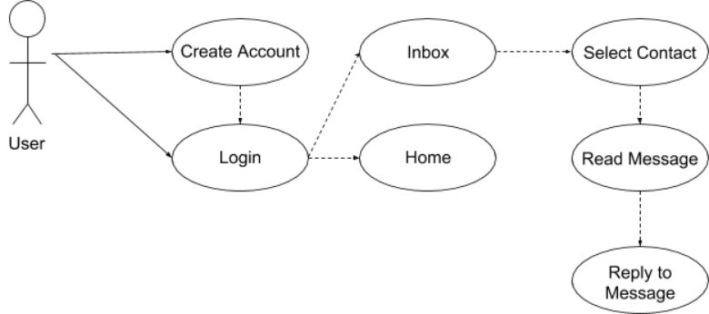

# AQUA - Permissions
## 1. Purpose
This is the third project within AQUA’s onboarding process for software engineers. It will be based on the previous project that was written in Ruby on Rails and deployed on Heroku. This project will incorporate user authentication with a permission system. Each permission level will have the ability to access certain pages within the web application. All of the source code will be stored on a repo through GitHub.

### 1.1 Requirements
* Use knowledge of the previous project, work together to do the following:
  * Build a permission system for multiple pages and access levels.
  * Automated messages set with a custom timer (minutes and hours up to 3 days in advance).
  * An admin user can go to settings page and send an automated message after a specific time/action.
* Use the following gems:
  * Brakeman (security)
  * Rubycritic
  * Bootstrap
  * Material Design
  * Rspec
* Other non-functional requirements:
  * GitHub - version control
  * Heroku - service
  * PostgreSQL - database
  * Ruby v2.4.0
  * Rails v5.1.4

## 2. Design Outline
Since this is a web application, it will use a client-server model as its architecture and Ruby on Rails as its framework. I will, also, include service worker (for Chrome, Firefox, and Opera) that will sit between the cache and the client. The database will use PosgreSQL.

### 2.1 Components:
* Web Client - UI that displays a calculator that takes user input to produce an output; evaluation of the expression will happen on the server and respond with the answer
* Server - receives requests from client to display the calculator, and sends the proper HTTP response containing the calculator
* Database - receives query from server, and sends results to server

### 2.2 Diagram:

## 3. Design Issues

### 3.1 Functional Issues

#### Issue: What will be displayed on the homepage?
* __Option 1__: User login/creation widget
* Option 2: User inbox, if cookies are present, otherwise user login/creation widget

We decided to go with this option, because it best describes the templates we are to be using in this project.

#### Issue: How will users create a new message?
* Option 1: User will press a button to open a popup window with input fields
* Option 2: User will press a button a new view is loaded onto the page with input fields
* __Option 3__: Search a user and click on their Namespace to send a message

We decided to go with this option, because it best describes the templates we are to be using in this project.  

#### Issue: How will users read a message?
* Option 1: User click will popup message info
* Option 2: User click will load a view containing message info
* __Option 3__: User click will load a partial with the conversation

We decided to go with this option, because it best describes the templates we are to be using in this project.  

#### Issue: How will users reply to a message?
* __Option 1__: An input field will be at the bottom of message info with a send button
* Option 2: User clicks reply to popup a reply input box

We decided to go with this option, because it best describes the templates we are to be using in this project.

#### Issue: How will user permissions be set?
* __Option 1__: Admin sets user permissions in a settings location, with a default of level 1
* Option 2: Have everyone be an admin of their own message groups using Apartment gem

This will be the easiest to create a distributed version of this software, as opposed to one company owning the entire thing.

#### Issue: How will automated messages be implemented?
* Option 1: Gem - Whenever
* Option 2: Rails - Active Jobs

We have not decided which one we are using yet, but once we get to this part it will be decided

### 3.2 Non-Functional Issues

#### Issue: What web application architecture will be used?
* __Option 1__: MVC
* Option 2: Flux

Since Ruby on Rails will be used, MVC will be the architecture for implementing this web application.

#### Issue: What web application framework will be used?
* __Option 1__: Ruby on Rails (Ruby 2.4.0 & Rails 5.1.4)
* Option 2: Node.js

Since Ruby on Rails will be used, Ruby on Rails will be the web application framework. Ruby version will be 2.4.0, and Rails will be version 5.1.4.

#### Issue: Where will the web application be deployed?
* __Option__ 1: Heroku
* Option 2: AWS
* Option 3: GCP

Since one of the requirement for the web application is to use Heroku, Heroku will be the location for deployment.

#### Issue: What user interface tools should be used?
* __Option 1__: Bootstrap
* __Option 2__: Material Design
* Option 3: Custom built

These two options were selected, because the template uses these to implement the user interface.

#### Issue: What database system should we use?
* __Option 1__: PostgreSQL
* Option 2: MySQL
* Option 3: NoSQL (MongoDB, CouchDB, etc)

PostgreSQL was chosen, because it's platform independent. It's, also, a requirement for this project.

## 4. Design Details

### 4.1 Database Diagram

### 4.2 User Interaction Sequence Diagram (Level 1)

### 4.3 User Interaction Sequence Diagram (Level 2)

### 4.4 User Interaction Sequence Diagram (Level 3)

### 4.5 User Interface Mockups
Register:

Login:

Home:

Login:

#### Settings
Data Table:

Text Area:

Option:

